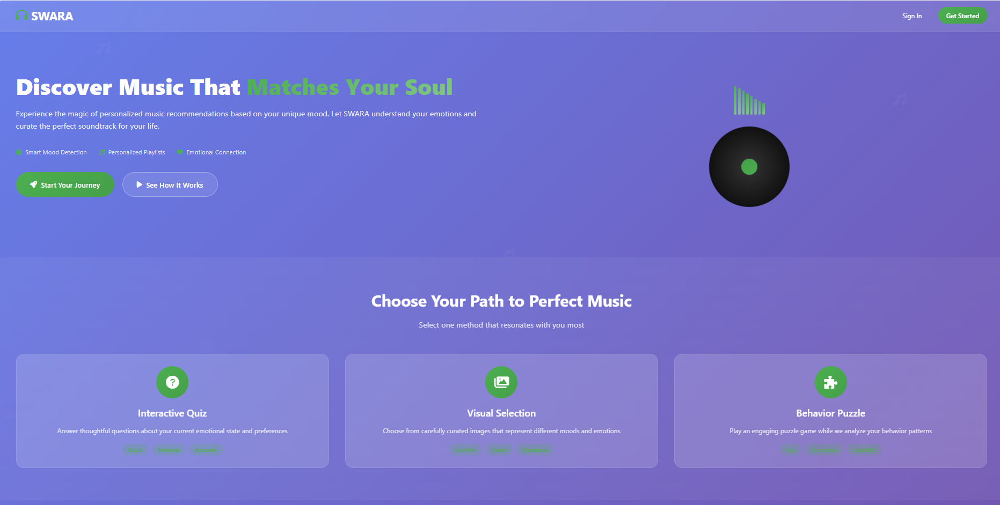
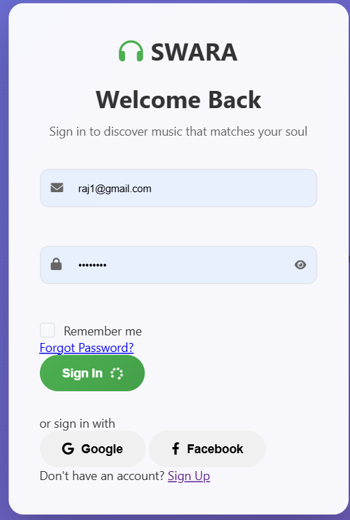
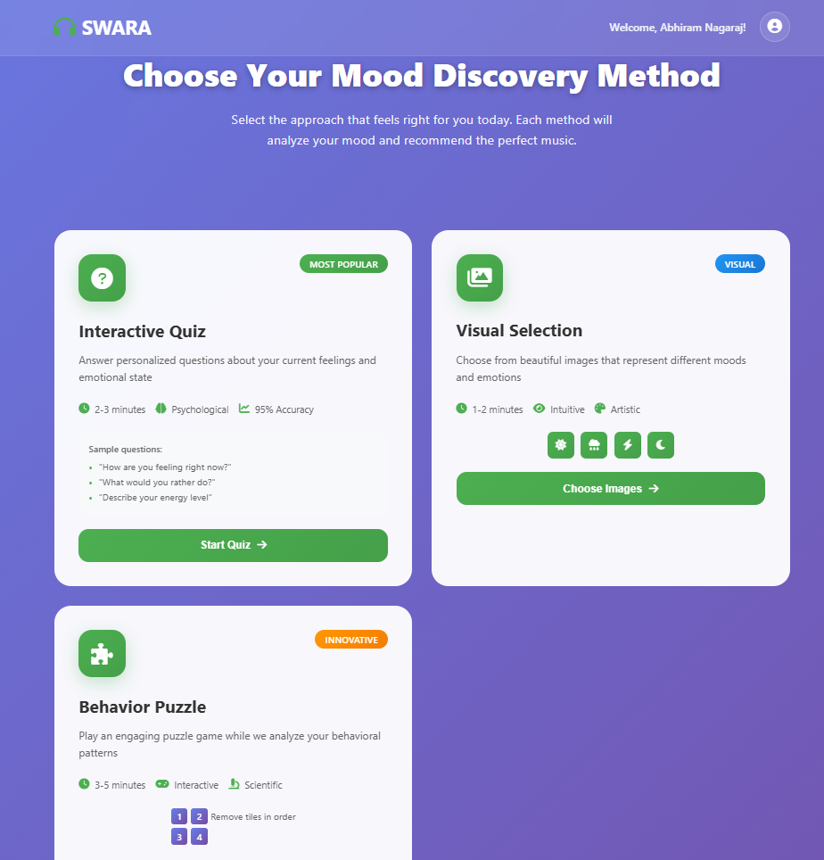
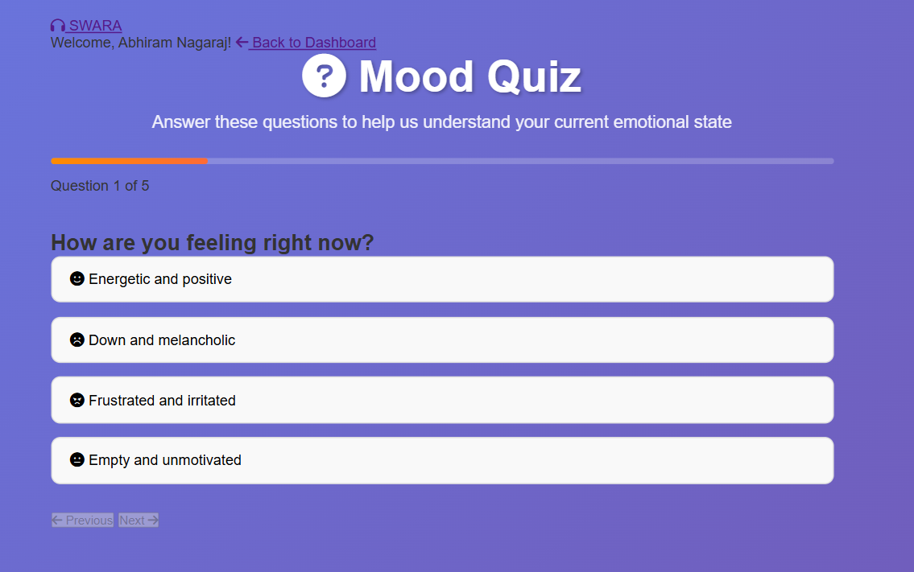
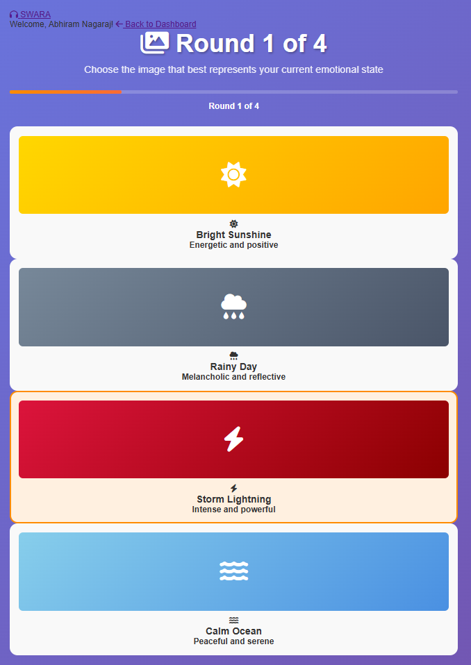
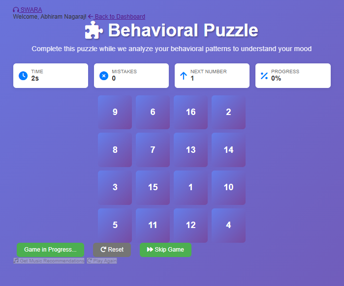

# 🎵 SWARA - AI-Powered Mood-Based Music Recommendation System

SWARA is an intelligent web application that detects your emotional state through multiple interactive methods and recommends personalized music based on your mood. Built with Flask, JavaScript, and modern web technologies.

## ✨ Features

### 🧠 Multi-Modal Mood Detection
- **Interactive Quiz**: Answer mood-related questions for psychological assessment
- **Visual Selection**: 4-round image selection system for comprehensive mood analysis
- **Behavioral Puzzle**: Cognitive puzzle game that analyzes your response patterns
- **Combined Analysis**: Aggregates results from multiple methods for accurate mood detection

### 🎨 Modern User Interface
- **Orange Theme**: Warm and energetic color scheme
- **Responsive Design**: Works seamlessly on desktop and mobile devices
- **Interactive Elements**: Smooth animations and hover effects
- **User Authentication**: Secure signup/login system

### 🎵 Smart Music Recommendations
- **Mood-Based Filtering**: Recommends songs that match your detected emotional state
- **Confidence Scoring**: Shows accuracy level of mood detection
- **YouTube Integration**: Direct links to listen to recommended songs
- **Multiple Genres**: Diverse music selection across different moods

## 🚀 Quick Start

### Prerequisites
- Python 3.7 or higher
- pip (Python package installer)

### Installation

1. **Clone the repository**
   ```bash
   git clone https://github.com/yourusername/swara.git
   cd swara
   ```

2. **Create a virtual environment**
   ```bash
   python -m venv venv
   ```

3. **Activate the virtual environment**
   ```bash
   # On Windows
   venv\Scripts\activate
   
   # On macOS/Linux
   source venv/bin/activate
   ```

4. **Install dependencies**
   ```bash
   pip install -r requirements.txt
   ```

5. **Run the application**
   ```bash
   python app.py
   ```

6. **Open your browser**
   Navigate to `http://localhost:5000`

## 📁 Project Structure

```
swara/
├── app.py                 # Main Flask application
├── database.py           # Database management and operations
├── requirements.txt      # Python dependencies
├── songs.db             # SQLite database with music data
├── static/              # Static assets
│   ├── css/            # Stylesheets
│   ├── js/             # JavaScript files
│   └── images/         # Image assets
├── templates/           # HTML templates
│   ├── dashboard.html   # User dashboard
│   ├── quiz.html        # Mood quiz interface
│   ├── images.html      # Visual selection interface
│   ├── puzzle.html      # Behavioral puzzle interface
│   └── auth/           # Authentication templates
├── screenshots/         # Application screenshots
│   └── README.md       # Screenshot guidelines
└── README.md           # Project documentation
```

## 🎯 How It Works

### 1. User Authentication
- Secure signup and login system
- Session management for user state

### 2. Mood Detection Methods

#### Quiz Method
- 5 carefully crafted mood-related questions
- Psychological assessment approach
- Confidence scoring based on answer consistency

#### Visual Selection Method
- **4 Rounds of Selection**:
  - Round 1: Basic mood indicators (Happy, Sad, Angry, Calm)
  - Round 2: Energy levels and intensity
  - Round 3: Social and emotional context
  - Round 4: Overall emotional state
- Mood averaging across all selections
- Visual feedback and progress tracking

#### Behavioral Puzzle Method
- 4x4 number sequence puzzle
- Analyzes response time, accuracy, and patterns
- Cognitive assessment for mood inference

### 3. Music Recommendation Engine
- Analyzes detected mood with confidence levels
- Filters music database by emotional tags
- Provides personalized song recommendations
- Direct YouTube integration for instant playback

## 🛠️ Technology Stack

- **Backend**: Flask (Python)
- **Database**: SQLite
- **Frontend**: HTML5, CSS3, JavaScript (ES6+)
- **Styling**: Custom CSS with modern design principles
- **Icons**: Font Awesome
- **Authentication**: Session-based with secure password handling

## 🎨 Design Features

- **Orange Theme**: Warm, energetic color palette (#FF8C00, #FF6B35)
- **Responsive Layout**: Mobile-first design approach
- **Smooth Animations**: CSS transitions and hover effects
- **Interactive Elements**: Dynamic feedback and real-time updates
- **Accessibility**: Keyboard navigation and screen reader support

## 📸 Screenshots

### 🏠 Landing Page

*Welcome to SWARA - Discover your perfect soundtrack*

### 👤 User Authentication

*Secure user registration with modern design*

### 🎯 Dashboard

*Choose your preferred mood detection method*

### 🧠 Mood Detection Methods

#### Quiz Interface

*Interactive psychological assessment*

#### Visual Selection

*Comprehensive 4-round visual mood analysis*


*Choose images that resonate with your emotions*

#### Behavioral Puzzle

*Cognitive assessment through interactive puzzle*

### 🎵 Results & Recommendations

*Accurate mood detection with confidence scoring*


*Personalized music suggestions with YouTube integration*

### 📱 Mobile Responsive

*Seamless experience across all devices*

## 📱 Usage Guide

### Getting Started
1. **Sign Up**: Create a new account with email and password
2. **Choose Method**: Select from Quiz, Visual Selection, or Puzzle
3. **Complete Assessment**: Follow the interactive prompts
4. **Get Recommendations**: Receive personalized music suggestions
5. **Listen & Enjoy**: Click on songs to listen on YouTube

### Mood Detection Tips
- **Be Honest**: Answer questions based on your true feelings
- **Trust Your Instinct**: Go with your first reaction in visual selection
- **Stay Focused**: Complete the puzzle without rushing
- **Multiple Attempts**: Try different methods for varied results

## 🔧 Configuration

### Environment Variables
Create a `.env` file in the root directory:
```env
FLASK_SECRET_KEY=your_secret_key_here
FLASK_ENV=development
```

### Database Setup
The application automatically creates the database on first run. To reset:
```bash
rm songs.db
python app.py
```

## 🤝 Contributing

1. Fork the repository
2. Create a feature branch (`git checkout -b feature/AmazingFeature`)
3. Commit your changes (`git commit -m 'Add some AmazingFeature'`)
4. Push to the branch (`git push origin feature/AmazingFeature`)
5. Open a Pull Request

## 📄 License

This project is licensed under the MIT License - see the [LICENSE](LICENSE) file for details.

## 🙏 Acknowledgments

- Font Awesome for beautiful icons
- Flask community for the excellent web framework
- YouTube for music integration
- All contributors and users of SWARA

## 📞 Support

If you encounter any issues or have questions:
- Create an issue on GitHub
- Check the documentation
- Review the code comments

---

**Made with ❤️ for music lovers everywhere**

*SWARA - Where emotions meet music*
